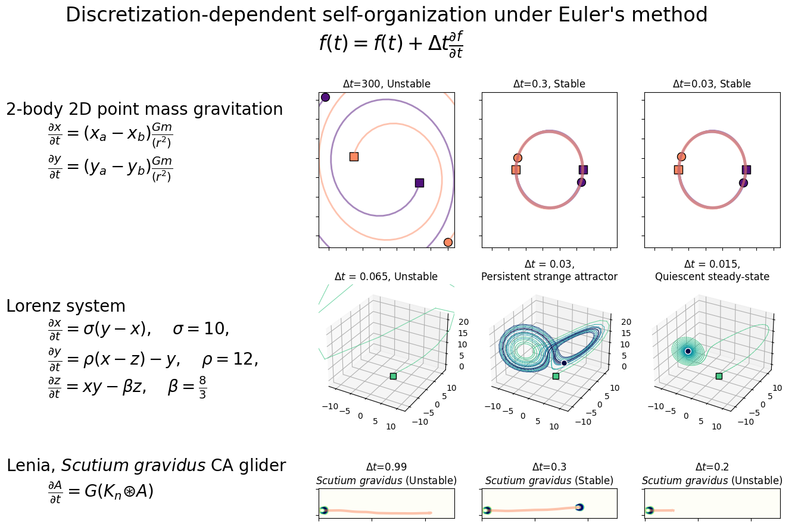

# Self-organization experiments in discrete approximations of complex continuous systems

This work examines the relationship between discretization and self-organizing, persistent mobile patterns in complex systems. Discretization has been described as a "necessary evil" for simulating continuous cellular automata (see [Rucker 1999](https://www.rudyrucker.com/pdf/rucker_continuous_CAs_in_2D.pdf). However, discretization and the systematic error that accompanies is apparently necessary for gliders to persist in multiple pattern-rule pairs across a wide variety of complex simulation systems that support them: several variants of continuous cellular automata, neural cellular automata, a reaction diffusion system, and a continuos cellular automata based on adam, adaptive moment estimation, an update method populer for training deep neural networks. 

Preliminary results and a description of the intention behind these experiments can be found in the [DisContinuous](https://rivesunder.github.io/DisContinuous) repository. DisContinuous includes an intentional outline of the project, links to code illustrating discretization effects on _Scutium gravidus_ and _Orbium_ Lenia gliders, and preliminary notebooks and animations.

This repository consolidates the code necessary for replicating experiments, and contains notebooks demonstrating each system of interest.

## Quick setup

This repo uses the [yuca](https://github.com/rivesunder/yuca) cellular automata simulator. 

To get started you can clone this repo and run `clone_install.sh` from within your virtual environment. This will install `yuca`. 

```
virtualenv disco_env --python=python3.8
source disco_env/bin/activate

git clone https://github.com/riveSunder/DiscoGliders.git disco_gliders
cd disco_gliders
pip install -e .

# script clones and runs setup for yuca, a cellular automata simulator used for experiments
sh clone_install.sh

# try and run yuca tests
python -m testing.test_all

# extract original results
tar -xf results/exp_06a.tar.xz -C ./results/
tar -xf results/exp_06b.tar.xz -C ./results/

# extra results, out to 4096 steps
tar -xf results/exp_06c.tar.xz -C ./results/
```

For animated examples of gliders, check out the [glider gallery](gallery.md).


# Notebooks

Notebooks for recreating Disco Gliders figures and introductions to each glider-supporting system can be found in the `notebooks` folder.

# Experiments

Experiments can be replicated using the files in `scripts` for gliders in Lenia, SmoothLife, Glaberish, and Neural CA, and by running the notebooks `notebooks/u_skate_world.ipynb` and `notebooks/adam_automata.ipynb` for gliders in U-Skate World and adam automaton systems. The notebook experiments rely on human assessment of glider persistence and use grid search, so coverage will be less complete compared to the scripted experiments, which use an adaptive random walk. 

